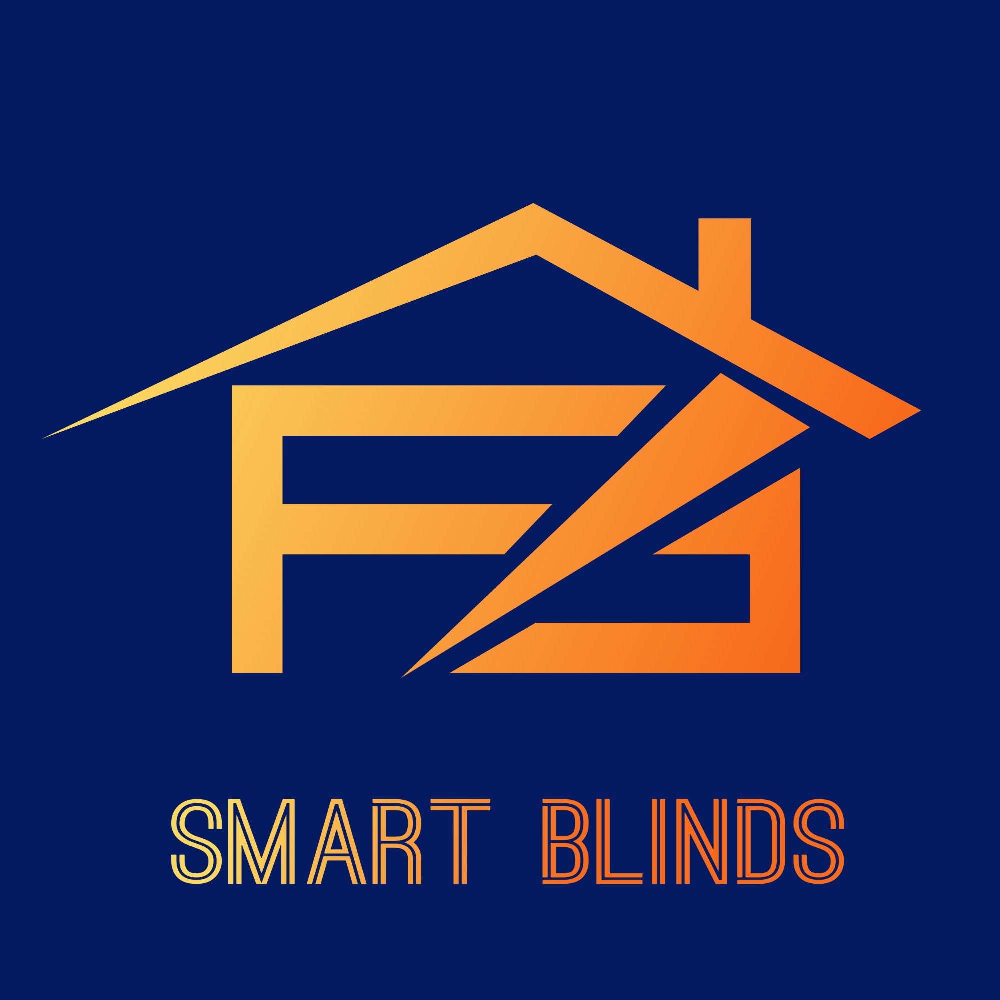

# Smart Blinds

## Идея

Проектът е базиран на Raspberry Pi 3 модел B, който посредством 2 електромотора ще управлява щорите. Ще има датчици за осветеност и температура, данните от които ще бъдат обработвани от Python-ска програма, като алгоритъм ще определя колко да бъдат отворени. Ще има touchscreen, с който потребителите ще може ръчно да управлява щорите и да променя параметрите, използвани от алгоритъма - например час на отваряне/затваряне; осветеност; температура

## Как да си сваля и използвам проекта?

### Използвани материали

* Raspberry Pi 3 модел B - [Линк към продукта](https://www.raspberrypi.org/products/raspberry-pi-3-model-b/)

* Сензори
    * BME280 сензор за влажност, налягане, температура - Waveshare - [Линк към продукта](https://erelement.com/sensors/bme280-ws?cPath=9&)
    * Сензор за светлина TSL2591, I2C интерфейс /Light Sensor/ - [Линк към продукта](https://erelement.com/sensors/tsl2591?cPath=9&)

* Двигател/и
    * Биполярен стъпков мотор 28 х 45 мм, 200 стъпки на оборот - [Линк към продукта](https://www.robotev.com/product_info.php?products_id=281&osCsid=1ep651hlrhbh188lsm37ukit24)

* Дисплей
    * Дисплей 4", 800x480, IPS, HDMI, Touch screen - резистивен SPI, Waveshare - [Линк към продукта](https://erelement.com/displays/lcd-4-inch-hdmi?cPath=36&)

### Инструкции за сваляне

1) Следвайте посочените [тук](https://projects.raspberrypi.org/en/projects/raspberry-pi-setting-up) инструкции, за да подготвите Raspberry Pi за употреба.
2) ...
3) ...

### Инструкции за инсталация

1) ...
2) ...
3) ...

### Инструкции за стартиране на проекта

1) ...
2) ...
3) ...

## Използвани технологии

* [Python](https://www.python.org/)
    * [RpiMotorLib](https://github.com/gavinlyonsrepo/RpiMotorLib/blob/master/Documentation/Nema11A4988.md)
